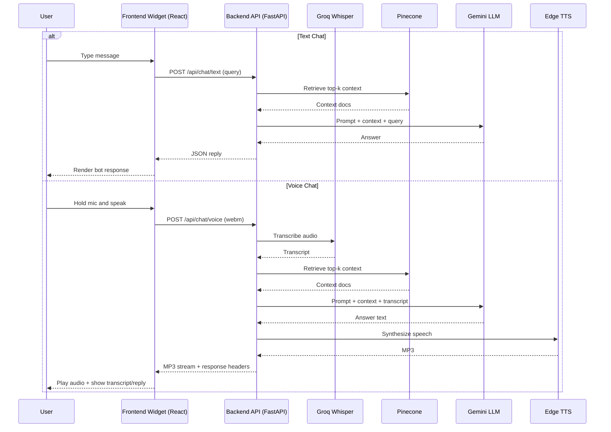

# Architecture: Hybrid Voice + Text RAG Chatbot

## 1. System Overview

This project is an embeddable website widget that supports:

- Text chat: user text -> RAG -> text reply
- Voice chat: user audio -> STT -> RAG -> TTS -> audio reply

It is split into two deployable services:

- `frontend/`: React + TypeScript floating chat widget
- `backend/`: FastAPI API with RAG orchestration and voice processing

## 2. Technology Stack

### Frontend
- React + TypeScript (Vite)
- Tailwind CSS for styling
- Browser MediaRecorder API for microphone capture

### Backend
- FastAPI for API endpoints
- LangChain for retrieval chain orchestration
- Google Gemini (`gemini-1.5-flash`) for generation
- Google embeddings (`models/text-embedding-004`) for vectorization
- Pinecone (serverless index) as vector database
- Groq Whisper (`whisper-large-v3`) for speech-to-text
- Edge TTS (`en-US-AriaNeural`) for text-to-speech

## 3. Data Flow

### 3.1 Knowledge Ingestion Flow

1. `backend/ingest.py` reads `backend/data.txt`
2. Text is chunked (size 1000, overlap 100)
3. Chunks are embedded with Google embeddings
4. Vectors are upserted into Pinecone index (`PINECONE_INDEX_NAME`)

### 3.2 Text Chat Runtime Flow

1. Frontend sends `POST /api/chat/text` with form field `query`
2. Backend retriever gets top-k documents from Pinecone (`k=3`)
3. Prompt + context sent to Gemini
4. Backend returns JSON: `{ "reply": "..." }`

### 3.3 Voice Chat Runtime Flow

1. Frontend captures microphone audio in `audio/webm`
2. Frontend sends `POST /api/chat/voice` with form field `audio`
3. Backend saves temporary input file
4. Groq Whisper transcribes audio to text
5. Backend runs RAG with transcript
6. Edge TTS synthesizes MP3 response
7. Backend streams MP3 back and sets headers:
   - `X-User-Query`
   - `X-Bot-Reply`

## 4. API Surface

- `GET /health`
  - Returns: `{ "status": "ok" }`
- `POST /api/chat/text`
  - Form: `query`
  - Returns: `{ "reply": "..." }`
- `POST /api/chat/voice`
  - Form: `audio` file
  - Returns: `audio/mpeg` stream + transcript headers

## 5. Environment Variables

Backend variables (`backend/.env`):

- `GOOGLE_API_KEY`
- `PINECONE_API_KEY`
- `GROQ_API_KEY`
- `PINECONE_INDEX_NAME` (for example `chatbot-rag`)

Frontend variable (`frontend/.env`):

- `VITE_API_BASE_URL` (for example `http://localhost:8000`)

## 6. Deployment Topology

Most common production topology:

- Backend on Render/Railway/Cloud Run (Docker)
- Frontend on Vercel/Netlify/static host
- Frontend points to backend via `VITE_API_BASE_URL`

## 7. Sequence Diagram

## 8. Operational Notes

- CORS is currently permissive (`allow_origins=["*"]`) for development.
- Restrict origins before production rollout.
- Pinecone index must match embedding dimension (`768`) and cosine metric.
- The backend removes temporary uploaded input files and schedules output cleanup after response.
